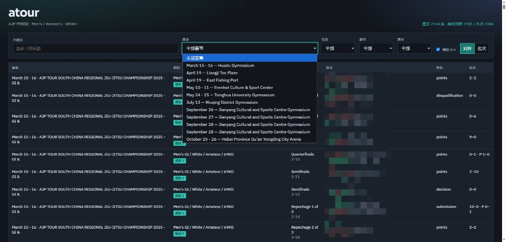

# atour

从 [AJP Tour](https://ajptour.com)（Smoothcomp）公开页面爬取**中国站**赛事数据，筛选 **Men's / Women's** 且腰带为 **White / Blue / Purple / Brown / Black** 的组别，导出对阵与名次 JSON，并提供本地可查询的 Web 页面。

> 数据仅来自站点公开接口与页面，请合理控制请求频率，遵守网站服务条款；本项目仅供学习与数据分析使用。



## 功能

- 解析年度赛事日历，按地点筛选中国站（`China` / `🇨🇳`）
- 按 `event_id` 去重（GI / NO-GI 常指向同一赛事页）
- 拉取各组对阵（胜负、比分、胜方、俱乐部、国家等）与名次表
- 每条记录附带 `opponent_count`：该组别总对手数（报名人数 − 1）
- 本地查询页：关键词 / 赛事 / 性别 / 腰带 / 赛制筛选，对阵与名次切换

## 技术栈

| 部分 | 技术 |
|------|------|
| 爬虫 / 导出 | Go 1.25+、标准库 `net/http` |
| HTML 解析 | `golang.org/x/net/html` |
| 数据存储 | SQLite（默认）或 MySQL |
| 查询页 | 原生 HTML / CSS / JS + REST API（无构建） |
| 筛选单测 | Node.js（`node:test`） |

## 环境要求

- [Go](https://go.dev/dl/) 1.25+
- 可选：[Node.js](https://nodejs.org/) 18+（仅跑前端筛选单测）

## 快速开始

```bash
git clone https://github.com/Shibuya-ku/atour.git
cd atour

# 可选：跑测试
go test ./...
node --test web/js/filter.test.mjs

# 方式 A：下载预打包 SQLite（推荐）
# https://github.com/Shibuya-ku/atour/releases/tag/data-2023-2026
# 解压得到 data/atour.db

# 方式 B：爬取 JSON 后导入
go run ./cmd/ajpscrape -out output
go run ./cmd/ajpdb import -from output -driver sqlite -dsn data/atour.db

# 启动（默认 SQLite）
go run ./cmd/ajpweb -db-driver sqlite -dsn data/atour.db

# 切换 MySQL 示例
# go run ./cmd/ajpdb import -from output -driver mysql -dsn "user:pass@tcp(127.0.0.1:3306)/atour?parseTime=true&charset=utf8mb4"
# go run ./cmd/ajpweb -db-driver mysql -dsn "user:pass@tcp(127.0.0.1:3306)/atour?parseTime=true&charset=utf8mb4"
```

浏览器打开：**http://localhost:8787/**

预打包 SQLite 见 [Release data-2023-2026](https://github.com/Shibuya-ku/atour/releases/tag/data-2023-2026)（`atour-db-2023-2026.zip`）；旧 JSON zip 仍保留作历史参考。也可自行爬取 JSON 后 `ajpdb import` 再启动。

## 爬取方式

### 命令

```bash
# 仅列出中国站赛事及符合条件的组别（不写文件）
go run ./cmd/ajpscrape -list-only

# 指定日历并导出
go run ./cmd/ajpscrape -calendar /en/events-1/events-calendar-2025 -out output

# 爬取 2026 赛季
go run ./cmd/ajpscrape -calendar /en/events-1/events-calendar-2026 -out output
```

### 参数

| 参数 | 默认值 | 说明 |
|------|--------|------|
| `-base` | `https://ajptour.com` | 站点根地址 |
| `-calendar` | `/en/events-1/events-calendar-2025` | 日历页路径 |
| `-out` | `output` | JSON 输出目录 |
| `-list-only` | `false` | 只打印赛事/组别列表 |

### 爬取流程（简述）

1. `GET` 日历页 HTML → 解析赛事链接与地点  
2. 过滤中国站 → 按 `event_id` 去重  
3. `GET /en/event/{id}/schedule/brackets.json` → 过滤成人 White+ 组别  
4. 并行拉取  
   - `/en/event/{id}/bracket/{bracketId}/getRenderData`（对阵）  
   - `/en/event/{id}/bracket/{bracketId}/getPlacementTableData`（名次）  
5. 写入 `output/events.json`、`matches.json`、`placements.json`

未发布 brackets 的赛事（如部分未来站）会标记 `brackets_unavailable`，不中断整体任务。单个组别拉取失败会跳过并打日志。

### 筛选规则

| 维度 | 规则 |
|------|------|
| 国家 | 地点或标题含 `China` / `🇨🇳` |
| 性别 | 组别名以 `Men's` / `Women's` 开头（不含 Youth / Boys / Girls） |
| 腰带 | 组别名含 `/ White|Blue|Purple|Brown|Black /`（不含 Grey 等少儿色带） |
| 赛制 | GI / NO-GI 均保留（由组别名区分） |

### 输出字段说明

**`matches.json`（对阵）** 主要字段：

- `event_id` / `bracket_id` / `division` / `match_id`
- `round_name` / `won_by` / `score_text` / `penalty_text`
- `left_*` / `right_*`（姓名、俱乐部、国家、结果）
- `winner_side`：`left` \| `right`
- `is_bye`：是否轮空
- `registrations_count`：该组别报名人数
- `opponent_count`：总对手数（`registrations_count - 1`）

**`placements.json`（名次）** 主要字段：

- `placement` / `name` / `club_name` / `affiliation_name`
- 同样包含 `registrations_count`、`opponent_count`

**`events.json`**：赛事摘要 + 各组详情嵌套结构（体积较大，查询页主要用扁平的 matches / placements）。

## 查询页

```bash
go run ./cmd/ajpweb
# 可选参数
go run ./cmd/ajpweb -addr :8787 -web web -db-driver sqlite -dsn data/atour.db
```

| 参数 | 默认值 | 说明 |
|------|--------|------|
| `-addr` | `:8787` | 监听地址 |
| `-web` | `web` | 前端静态目录 |
| `-db-driver` | `sqlite` | 数据库驱动：`sqlite` \| `mysql` |
| `-dsn` | `data/atour.db` | SQLite 路径或 MySQL DSN |

页面能力：

- 关键词：选手 / 俱乐部  
- 筛选：赛事、性别、腰带、赛制  
- 视图：对阵 / 名次  
- 默认隐藏 BYE  
- 组别旁展示「对手 N」标识  

## 目录结构

```
atour/
├── cmd/
│   ├── ajpscrape/     # 爬虫 CLI
│   ├── ajpdb/         # JSON → DB 导入
│   └── ajpweb/        # API + 静态站点
├── internal/
│   ├── ajp/           # 日历解析、过滤、拉取、流水线
│   ├── export/        # JSON 导出
│   └── store/         # SQLite / MySQL 存储与 API 查询
├── web/               # 查询页（HTML/CSS/JS）
├── assets/            # README 配图等
└── testdata/          # 单测 fixture
```

## 测试

```bash
# Go 单元测试 / 集成（含 httptest）
go test ./...

# 跳过需外网的 live 日历测试
go test ./... -short

# 前端筛选逻辑
node --test web/js/filter.test.mjs
```

## 注意事项

1. **网络与 Cloudflare**：偶发超时或拦截属正常，客户端带重试与超时；失败组别会跳过。可隔一段时间重跑覆盖。  
2. **请求礼貌**：默认请求间隔约 250ms，组别详情 4 路并发；请勿随意加大并发以免给源站造成压力。  
3. **数据时效**：赛程与结果以 AJP 官网为准；重新爬取会覆盖 `-out` 目录中的同名 JSON。  
4. **体积**：完整 `events.json` 可能较大；查询页使用 SQLite，预打包 DB 见 [Release](https://github.com/Shibuya-ku/atour/releases/tag/data-2023-2026)（解压为 `data/atour.db`）。`output/`、`data/` 均不进 Git。

## License

按需自行补充开源协议。使用爬取数据时请遵守 [ajptour.com](https://ajptour.com) 相关条款与当地法律法规。
